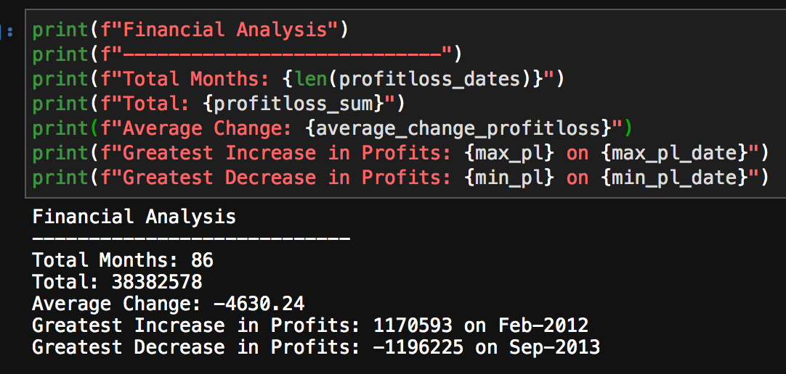
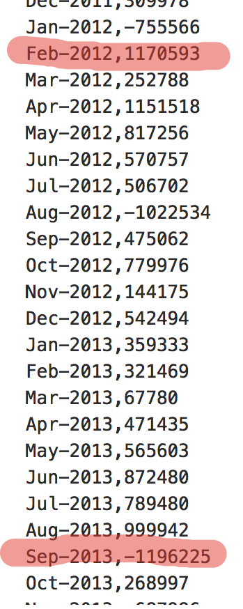

# python-homework

Note to TA: In my results I got different figures, but they seem correct accordingly budget_data.csv file. 

I believe the budget_data.csv file is not the same as one used to come up with the sample text. 

 

For me this work was quite hard, I requested few additional days from Ashley to finish it. In the end I had to ask my friend help me, just to let you know. 
I'm planning to work more on this, to improve my Python skills.

